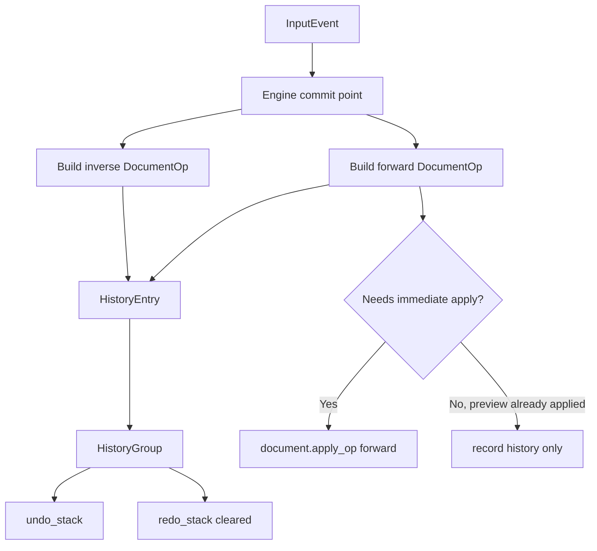
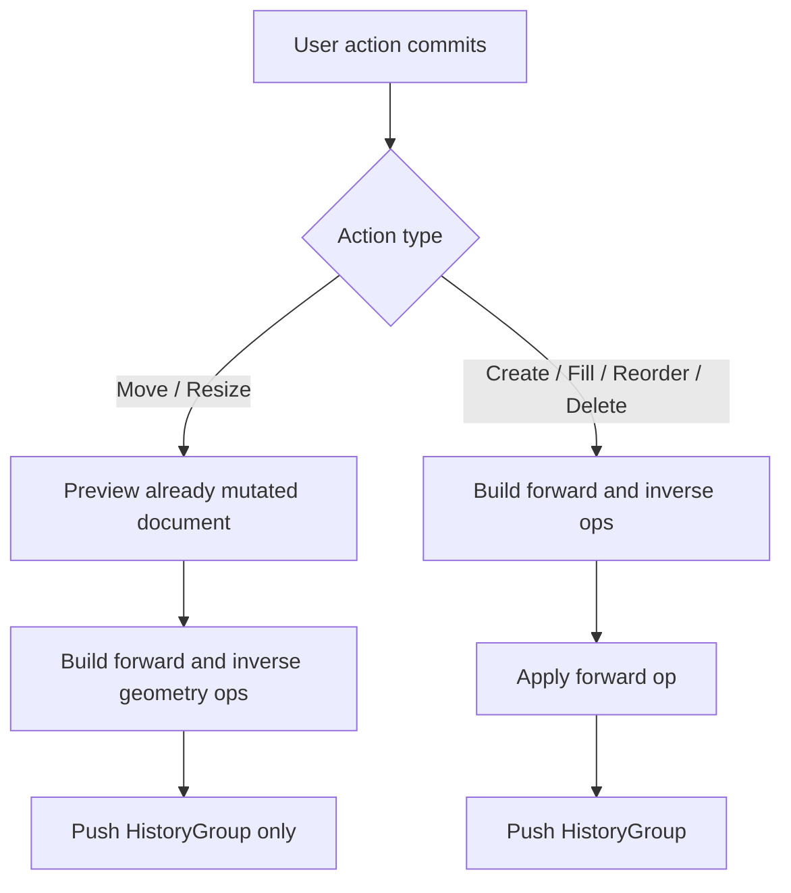
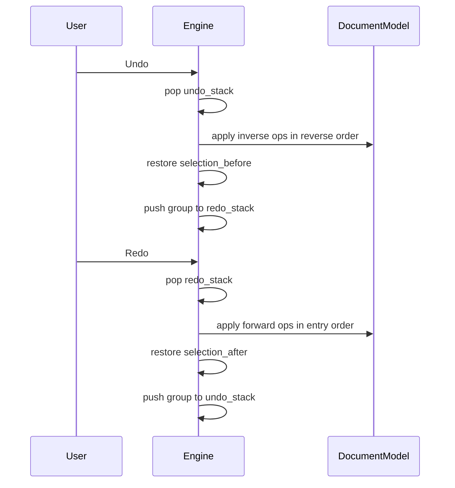

# Phase 3 Revised Plan - Operation-Based History

## Goal

Redesign local undo/redo so history is built around invertible `DocumentOp` groups instead of `ToolCommand`-specific engine mutations.

This keeps the current single-player editor behavior intact while moving the engine toward the collaboration-friendly shape described in `refactor_engine.md`.

## What Is Wrong Today

The current implementation in `crates/engine/src/engine.rs` is still transitional:

- `undo_stack` and `redo_stack` store `ToolCommand` values
- forward paths partly use `DocumentOp`, but inverse paths are still mixed between ad hoc mutations and partial inversion logic
- `SetRectsGeometry` undo is incorrect because the same `changes` payload is reapplied on undo instead of swapping `before` and `after`
- reorder undo is not modeled as a true inverse history operation
- delete undo restores nodes directly into `document.rects` instead of flowing through `apply_op()`

Phase 3 should fix those issues by making history explicitly operation-based.

## Revised Target Design

### 1. Keep `DocumentOp` as the shared mutation format

`DocumentOp` remains the document-layer source of truth for persistent mutations.

It should continue to exclude local-only concerns such as:

- selection restoration
- drag state
- hover state
- local tool interaction state

### 2. Introduce local history entries built from forward and inverse ops

Use history types like this:

```rust
pub struct HistoryEntry {
    pub forward: DocumentOp,
    pub inverse: DocumentOp,
}

pub struct HistoryGroup {
    pub entries: Vec<HistoryEntry>,
    pub selection_before: Vec<NodeId>,
    pub selection_after: Vec<NodeId>,
}
```

Key points:

- `HistoryEntry` stores one forward op and one already-computed inverse op
- `HistoryGroup` represents one user action
- selection snapshots live on the group, not inside `DocumentOp`
- undo/redo stacks store `HistoryGroup`, not `ToolCommand`

### 3. Apply undo in reverse order

If a single user action eventually contains multiple ops, undo must replay inverse entries in reverse order.

- redo: apply `forward` ops in entry order
- undo: apply `inverse` ops in reverse entry order

This is important even if many current actions only produce a single entry.

## Required Operation Changes

## Add `RestoreNodes`

`DeleteNodes` cannot be cleanly undone with just `node_ids`, so add an explicit inverse operation:

```rust
pub enum DocumentOp {
    CreateRect {
        id: NodeId,
        pos: Vec2,
        size: Vec2,
        color: [f32; 4],
    },
    SetRectsGeometry {
        changes: Vec<RectGeometryChange>,
    },
    SetRectsFill {
        changes: Vec<RectFillChange>,
    },
    ReorderNodes {
        node_ids: Vec<NodeId>,
        placement: ReorderPlacement,
    },
    DeleteNodes {
        node_ids: Vec<NodeId>,
    },
    RestoreNodes {
        nodes: Vec<(RectNode, usize)>,
    },
}
```

`DocumentModel::apply_op()` in `crates/engine/src/types.rs` should then gain a `RestoreNodes` arm that reinserts missing nodes at their original indices.

## Build inverse ops at commit time

Treat inverse construction as a history-layer responsibility.

That means:

- some ops can be inverted mechanically by swapping `before` and `after`
- some ops need document snapshots captured at commit time
- the code should not assume every op is self-invertible without context

Practical rules:

- `CreateRect` inverse -> `DeleteNodes { node_ids: vec![id] }`
- `SetRectsGeometry` inverse -> swap `before` and `after` in each change
- `SetRectsFill` inverse -> swap `before` and `after` in each change
- `DeleteNodes` inverse -> `RestoreNodes { nodes }`
- `ReorderNodes` inverse -> opposite placement for the same `node_ids`

## Important nuance: preview mutations are already applied during drag

Move and resize previews currently mutate `DocumentModel` continuously during pointer move in `crates/engine/src/session.rs`.

That means pointer-up behavior differs by action type:

- move/resize: document is already in final state when the drag commits
- rect creation: document is not yet mutated until commit
- fill/delete/reorder: document is not yet mutated until commit

So the Phase 3 history flow must handle both cases.

## Revised Implementation Plan

### Step 1 - Replace `ToolCommand` with history-specific types

In `crates/engine/src/history.rs`:

- keep `RectGeometry`, `RectGeometryChange`, and `RectFillChange`
- remove `ToolCommand`
- add `HistoryEntry`
- add `HistoryGroup`

Result:

- history becomes document-op based
- selection restoration remains local-history metadata

### Step 2 - Extend `DocumentOp` and `apply_op()`

In `crates/engine/src/ops.rs` and `crates/engine/src/types.rs`:

- add `DocumentOp::RestoreNodes`
- implement `apply_op()` support for `RestoreNodes`

Result:

- delete undo no longer bypasses the document op application path

### Step 3 - Move engine stacks to `HistoryGroup`

In `crates/engine/src/engine.rs`:

- change `undo_stack: Vec<ToolCommand>` to `undo_stack: Vec<HistoryGroup>`
- change `redo_stack: Vec<ToolCommand>` to `redo_stack: Vec<HistoryGroup>`
- update all test fixture initializers accordingly

Result:

- the engine history format matches the new architecture

### Step 4 - Add helpers to build history groups

Add small engine helpers for clarity:

```rust
fn push_history_group(&mut self, group: HistoryGroup)
fn apply_history_group(&mut self, group: &HistoryGroup, forward: bool)
```

Behavior:

- `push_history_group()` pushes to undo and clears redo
- `apply_history_group(..., true)` applies `entry.forward` in order, then restores `selection_after`
- `apply_history_group(..., false)` applies `entry.inverse` in reverse order, then restores `selection_before`

Result:

- `apply_command()` disappears entirely
- undo/redo behavior becomes structurally obvious

### Step 5 - Convert each commit site to history groups

This is the most important implementation step.

#### 5a. Move drag commit

Current move drag behavior:

- preview mutation already happened during pointer move
- pointer-up should not reapply the forward op

Implementation rule:

- build one `DocumentOp::SetRectsGeometry { changes }` from original positions to final positions
- build one inverse geometry op by swapping each change
- push a `HistoryGroup` only if `changes` is non-empty
- do not apply the forward op again on pointer-up

#### 5b. Resize drag commit

Same pattern as move drag:

- preview already mutated the document
- pointer-up records history only
- no forward reapply

#### 5c. Rect creation commit

Rect creation still needs apply-then-record:

- build forward `CreateRect`
- build inverse `DeleteNodes`
- apply forward op
- push `HistoryGroup`

#### 5d. Fill change commit

- build forward `SetRectsFill`
- build inverse `SetRectsFill` with swapped colors
- apply forward op
- push `HistoryGroup`

#### 5e. Reorder commit

- build forward `ReorderNodes`
- build inverse `ReorderNodes` with opposite placement
- apply forward op
- push `HistoryGroup`

This is where the current reorder undo bug gets fixed.

#### 5f. Delete commit

- collect `(RectNode, original_index)` before mutation
- build forward `DeleteNodes`
- build inverse `RestoreNodes`
- apply forward op
- push `HistoryGroup`

This is where delete undo becomes fully operation-based.

### Step 6 - Simplify `undo()` and `redo()`

After commit sites are migrated:

- `undo()` pops a `HistoryGroup`, applies it backward, and pushes it to redo
- `redo()` pops a `HistoryGroup`, applies it forward, and pushes it back to undo

Both methods should still ignore requests while drag is active.

### Step 7 - Remove dead transitional code

After all paths are migrated:

- remove `ToolCommand`
- remove `apply_command()`
- update `crates/engine/src/lib.rs` re-exports

Result:

- Phase 2 transitional history code is fully retired

### Step 8 - Add missing undo/redo tests before and after migration

Add focused tests in `crates/engine/src/engine.rs` for:

- undo create rect removes the rect and restores selection
- redo create rect restores the same rect and selection
- undo move restores original geometry
- redo move restores final geometry
- undo resize restores original geometry
- undo fill restores original color
- undo reorder restores original z-order
- undo delete restores deleted nodes at original indices
- undo then redo returns the same final document
- redo stack clears after a new local edit

These tests are required because the current suite exercises interaction behavior heavily but not history correctness.

## Mermaid Diagrams

### High-Level History Architecture



### Commit Flow by Action Type



### Undo / Redo Flow



## File-by-File Change Map

### `crates/engine/src/history.rs`

- keep geometry and fill change structs
- replace `ToolCommand` with `HistoryEntry` and `HistoryGroup`

### `crates/engine/src/ops.rs`

- add `RestoreNodes`
- keep `DocumentOp` focused on shared document mutations only

### `crates/engine/src/types.rs`

- add `apply_op()` support for `RestoreNodes`

### `crates/engine/src/engine.rs`

- replace stack element types
- add history group helpers
- migrate all commit sites
- delete `apply_command()`
- add undo/redo tests

### `crates/engine/src/lib.rs`

- export new history types instead of `ToolCommand`

## Why This Plan Fits Phase 3

This revised plan matches the Phase 3 objective in `refactor_engine.md` because it:

- redesigns history around invertible document operations
- keeps local UI restoration separate from the shared document op format
- preserves current single-player behavior
- fixes known undo correctness gaps while introducing the new abstraction
- prepares the engine for later collaboration-aware history semantics without forcing multiplayer complexity now

## Recommended Implementation Order

1. Add undo/redo tests that describe intended behavior
2. Add `RestoreNodes` to `DocumentOp` and `apply_op()`
3. Introduce `HistoryEntry` and `HistoryGroup`
4. Convert engine stacks and helper methods
5. Migrate create, fill, reorder, and delete commit sites
6. Migrate move and resize commit sites carefully to avoid double-apply
7. Remove `ToolCommand` and `apply_command()`
8. Run `cargo test -p engine`

This ordering minimizes risk because it stabilizes expected behavior first, then replaces the transitional history plumbing in small steps.
